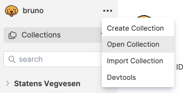
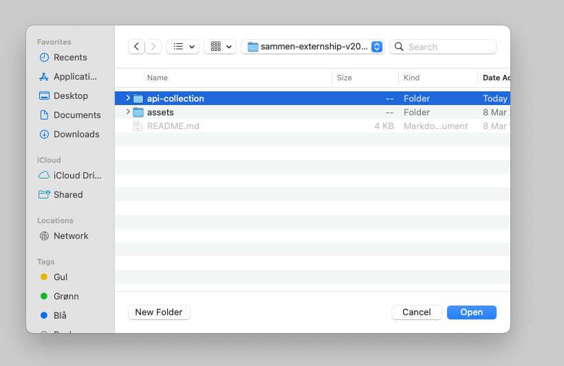
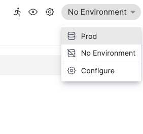
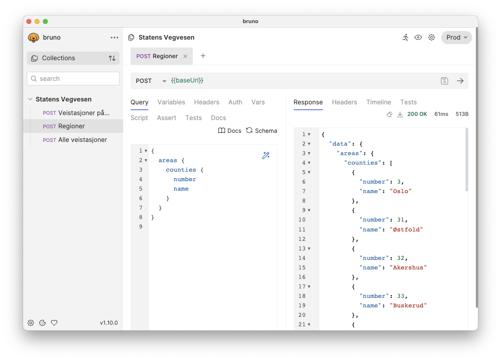
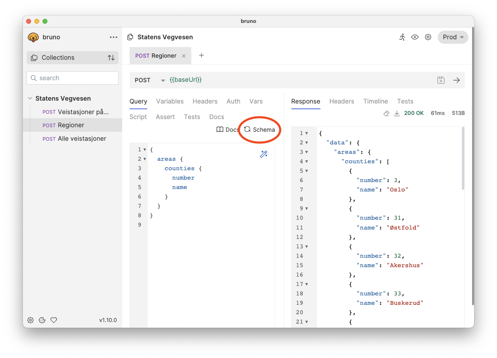
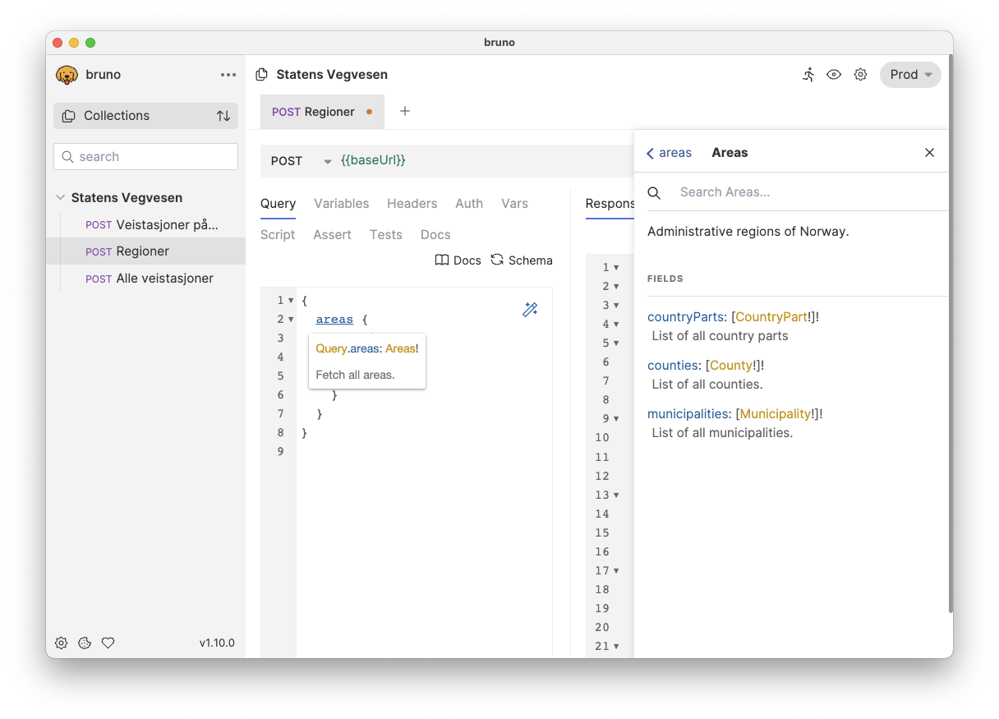

<p align="center">
<picture>
<source media="(prefers-color-scheme: dark)" srcset="./assets/skysslogo-darkmode.svg">
<source media="(prefers-color-scheme: light)" srcset="./assets/skysslogo-lightmode.svg">

</picture>
</p>

# Sammen Externship våren 2024

Velkommen til Skyss!

Skyss har nettopp startet arbeidet med å etablere en ny dataplattform.
En del av dette er å utforske potensielle kilder for relevant data.
Dette inkluderer selvfølgelig data vi får direkte fra kjøretøyene som er i oppdrag for Skyss, og fra operatørene som drifter disse (f.eks. Tide og Norled).
I tillegg kan det være andre eksterne datakilder som er relevante.

Et eksempel vi ønsker at dere undersøker nærmere er [trafikkdata fra Statens Vegvesen](https://trafikkdata.atlas.vegvesen.no/#/om-trafikkdata).
Dette datasettet inneholder aggregerte data om trafikkvolum fra målepunkter plassert rundt omkring på veier i landet.
Utover dette har vi i Skyss i liten grad innsikt i hva som finnes i datasettet, og hvilken kvalitet det har – her trenger vi hjelp fra dere :)

Generelt er Skyss alltid interessert i å vite mest mulig om trafikkbildet, både i nåtid (ikke mulig med dette API-et), og historisk.
Dette kan bl.a. være for å se på bakgrunnen for forsinkelser i busstrafikken, og å vurdere om ruter burde endres i fremtiden.

Merk at denne oppgaven er _meget_ åpen, og at det ikke er noen krav til en leveranse.
Det vi ønsker oss er at dere gjør deres beste for å bli kjent med APIet og hvilken informasjon en kan hente utifra det, og hvis dere har tid, presenterer denne på en eller annen måte.
Det kan f.eks. være i en presentasjon, på en nettside, i en Jupyter Notebok, et script, eller hva som helst. Det er helt opp til dere!

## Teknisk om API-et

API-et er tilgjengelig her: https://trafikkdata-api.atlas.vegvesen.no/.
Om dere besøker det fra nettleseren kommer dere til en interaktiv GraphQL-klient.
Denne kan brukes til å prøve ut ulike spørringer, og å se dokumentasjon på de ulike typene og spørringene som er tilgjengelige.

Dokumentasjonen er tilgjengelig her: https://trafikkdata.atlas.vegvesen.no/#/om-api.
Her finnes det også eksempler på praktisk bruk av API-et og eksempler med `curl` og JavaScript.

### Om GraphQL

Det er et **GraphQL-API**.
Om dere ikke er kjent med GraphQL fra før finnes det mye nyttig informasjon på den [offisielle hjemmesiden](https://graphql.org/learn/).
Kort fortalt innebærer det at en i stedet for å benytte ulike URL-er for å be om ulik informasjon.
Med et tradisjonelt REST-API ville en ha sendt en `GET`-request til f.eks. `/pets/{petId}` for å hente informasjon om et kjæledyr.
Med GraphQL er alle requests en `POST` til samme endepunkt, f.eks. `/graphql`, hvor spørringens body inneholder en GraphQL-spørring som spesifiserer hvilken data vi ønsker å få tilbake.
Et eksempel på en slik body er

```graphql
{
  pet(petId: 123) {
    name
    category {
      id
      name
    }
  }
}
```

Responsen på en slik spørring kan da se slik ut:

```json
{
  "pet": {
    "name": "Fido",
    "category": {
      "id": 1,
      "name": "dog"
    }
  }
}
```

Igjen, se den [offisielle dokumentasjonen](https://graphql.org/learn/) for mer informasjon.

Det finnes flere GraphQL-klienter en kan velge å benytte med ulike kodespråk.
Se f.eks. [GQL](https://github.com/graphql-python/gql) for Python og [Apollo Client](https://www.apollographql.com/docs/react/) for Javascript. Å bruke en klient er selvfølgelig valgfritt.

### Bruno

For å komme raskt i gang med å teste ut API-et lokalt på din maskin kan du bruke [API-klienten Bruno](https://www.usebruno.com/).
Det er lagt noen eksempler i [`api-collection`](./api-collection/).

Gjør følgende for å åpne disse med Bruno:

1.  Klon dette repoet lokalt til din maskin:
    ```shell
    git clone https://github.com/skyss/sammen-externship-v2024-case.git
    ```
1.  Last ned og installer Bruno fra https://www.usebruno.com/downloads.
1.  Åpne Bruno. Trykk på de tre prikkene øverset til venstre, og velger deretter _Open Collection_.

    

1.  Velg mappen _api-collection_ i dette repoet og trykk OK.

    

1.  Statens Vegvesen burde nå være synlig i panelet til venstre.
    Trykk på overskriften for å velge en av spørringene.
    Før den kjøres må en velge et miljø _(environment)_ som inneholder variablene en trenger. I dette tilfellet trenger du miljøet _Prod_ som inneholder variabelen `baseUrl`. Det velges oppe i høyre hjørne:

    

1.  Nå er Bruno klart til å gjøre en spørring. Bruk hurtigtasten som vises i vinduet eller trykk på pilen til høyre i adressefeltet.
    Svaret blir synlig i panelet til høyre:

    

1.  Når dere skal i gang med å skrive egne spørringer er det veldig nyttig å ha importert GraphQL-skjemaet (_schema_) inn i Bruno. Dette gjøres ved å trykke på _Schema_:

    

    Dette gjør at _Docs_-knappen som er rett ved siden av _Schema_ fungerer og gir informasjon om de ulike spørringene som er tilgjengelig. En kan også trykke på et felt i spørringen mens en holder inne <kbd>Ctrl</kbd> (Windows/Linux) eller <kbd>⌘</kbd> (Mac) for å få opp dokumentasjonen for det feltet.

    

## Forventninger

Igjen, dette er en helt åpen oppgave.
Om det er mye av det over som er helt nytt er det for mye å forvente at en skal få opp en nettside eller noe lignende.
Det holder lenge med en gjennomgang av hva som finnes i API-et!

Det vi forventer er at dere gjør så godt dere kan, og at dere presenterer det dere har funnet ut :)

Lykke til!
